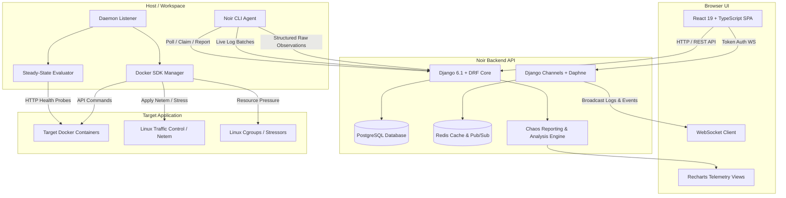
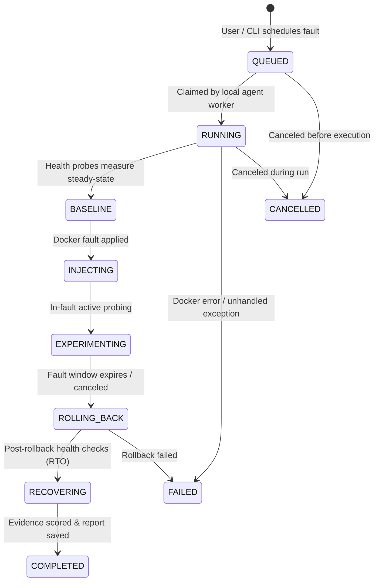

# Noir

**AI-Powered Reliability Engineering & Chaos Engineering Platform**

[](file:///home/amalskumar/projects/College%20Projects/Continues/noir/backend)
[](file:///home/amalskumar/projects/College%20Projects/Continues/noir/frontend)
[](file:///home/amalskumar/projects/College%20Projects/Continues/noir/agent)
[-success)](file:///home/amalskumar/projects/College%20Projects/Continues/noir/test)

---

## Table of Contents

1. [What Noir Does](#what-noir-does)
2. [Architecture](#architecture)
3. [Core Components](#core-components)
4. [Experiment Lifecycle](#experiment-lifecycle)
5. [Measurement Model & Statistical Integrity](#measurement-model--statistical-integrity)
6. [Supported Fault Injection Types](#supported-fault-injection-types)
7. [Resilience Reporting Engine](#resilience-reporting-engine)
8. [Noir CLI Agent](#noir-cli-agent)
9. [REST API Surface](#rest-api-surface)
10. [Real-Time WebSocket Streaming](#real-time-websocket-streaming)
11. [Authentication & Authorization](#authentication--authorization)
12. [Docker Integration & Discovery](#docker-integration--discovery)
13. [Installation & Setup](#installation--setup)
14. [Testing Architecture & Boundaries](#testing-architecture--boundaries)
15. [Test Coverage Matrix](#test-coverage-matrix)
16. [What Selenium Cannot Test](#what-selenium-cannot-test)
17. [Known Limitations](#known-limitations)
18. [Project Roadmap (Implemented vs. Planned)](#project-roadmap)

---

## What Noir Does

Noir is an enterprise-grade automated reliability and chaos engineering platform designed for Dockerized backend microservices and web applications. It bridges the gap between active fault injection and scientific evidence verification:

- **Controlled Fault Injection**: Safely introduces network delays, packet loss, CPU saturation, memory pressure, container stops, and container restarts into designated Docker containers without affecting host stability.
- **Continuous Steady-State Measurement**: Probes application endpoints before, during, and after disruptions using high-resolution HTTP health monitoring.
- **Automated Rollback & Cleanup**: Automatically restores system state after fault durations expire or in the event of unexpected exceptions.
- **Recovery Time Objective (RTO) Validation**: Algorithmically measures time-to-recovery requiring sustained consecutive healthy probe confirmations.
- **Resilience Scoring & Evidence Gating**: Calculates resilience scores (0–100) and letter grades (A through F, or INCONCLUSIVE) strictly gated by sample count and measurement confidence.
- **Evidence-Driven Findings & Root Cause Indicators**: Evaluates explicit scientific hypotheses against observed telemetry to generate actionable findings and follow-up validation experiments.
- **Cross-Experiment Project Synthesis**: Aggregates multi-run chaos telemetry into collective reports with outlier detection and deduplicated remediation roadmaps.

---

## Architecture



---

## Core Components

### 1. Frontend Web Application (`frontend/`)
- Built with React 19, TypeScript, Vite, Tailwind CSS v4, Lucide icons, and Recharts.
- Implements role-based routing for **Developers**, **Company Admins**, and **Platform Admins**.
- Interactive workspace dashboards, real-time log terminal, container discovery view, chaos injection panel, and in-depth report visualizations.

### 2. Django Backend & API (`backend/`)
- Django 6.1 with Django REST Framework, SimpleJWT authentication, and Django Channels 4.
- Four core apps:
  - `apps.accounts`: Registration, multi-role auth, JWT tokens, OAuth exchange, company profiles, notifications, and teams.
  - `apps.users`: Administrative user governance, role management, and directory filtering.
  - `apps.projects`: Project workspaces, profiles, container catalog, fault queue, and log streaming.
  - `apps.cli`: CLI integration endpoints.
- High-fidelity reporting engine (`apps/projects/chaos_reporting.py`) delivering statistical aggregation, finding generation, hypothesis validation, and collective project summaries.

### 3. Noir CLI Agent (`agent/`)
- Standalone Python CLI built with Typer, Rich, HTTPX, and Docker SDK.
- Manages local project pairing, workspace scanning, daemon execution (`noir fault listen`), and standalone fault injection (`noir fault inject`).
- Runs local health probes (`SteadyStateEvaluator`), executes container operations via `DockerManager`, enforces automatic rollback, and computes raw telemetry.

### 4. Chaos Engine (`agent/noir/faults/`)
- Pure Python modular fault execution library with parameter validation, execution sandboxing, and guaranteed rollback hooks.
- Direct Linux traffic control integration (`tc netem`) and resource allocation stressors (`dd`, `kill`, cgroup throttling).

### 5. Measurement Engine (`agent/noir/faults/experiment.py` & `backend/apps/projects/chaos_reporting.py`)
- Independent, double-verified measurement implementations on both agent and backend.
- Enforces strict safety gates for P95/P99 sample counts, 3-sigma anomaly detection, consecutive healthy probe streaks for recovery, and evidence confidence scoring.

---

## Experiment Lifecycle

Every chaos experiment moves through a deterministic, strictly monitored lifecycle:



### Phase Details

1. **QUEUED**: Fault requested with target container, fault type, duration, and safety parameters. Stored in FIFO project queue.
2. **RUNNING / PREPARING**: Agent claims job via atomic API endpoint `/claim/`. Validates container availability and Docker daemon socket.
3. **BASELINE**: Probes target endpoint for steady-state baseline (default 3–5 probes). Computes baseline availability, mean latency, and P95 latency.
4. **INJECTING**: Applies fault via Docker SDK or container exec (`tc`, `stress`, pause/restart).
5. **EXPERIMENTING**: Executes high-resolution active probes throughout the fault hold window. Streams live log batches to the backend.
6. **ROLLING_BACK**: Disables netem rules, terminates stress processes, or restarts stopped containers. Guaranteed to run in `finally:` blocks.
7. **RECOVERING**: Continuously probes target endpoint until 3 consecutive successful probes verify recovery or RTO timeout expires.
8. **COMPLETED / FAILED / CANCELLED**: Raw observations are compiled, metrics aggregated, findings detected, and resilience report finalized.

---

## Measurement Model & Statistical Integrity

Noir adheres to the core axiom: **Noir must never claim a system behavior that its observations cannot support.**

### 1. Authoritative Raw Observations
- All analysis stems from immutable `ProbeObservation` records capturing sequence, phase (`baseline`, `fault`, `recovery`), timestamp, status code, success boolean, and latency in milliseconds.
- Derived metrics are 100% reproducible and can be recomputed from raw stored observations at any time.

### 2. Strict Sample-Count Safety Gates
- **P99 Latency**: Requires a minimum of **20 valid samples**. If `n < 20`, P99 returns `None` and status reports `INSUFFICIENT_SAMPLES`.
- **P95 Latency**: Requires a minimum of **10 valid samples**. If `n < 10`, P95 returns `None` and status reports `INSUFFICIENT_SAMPLES`.
- **Standard Deviation**: Requires a minimum of **5 valid samples**.
- **Failed Probe Exclusion**: Probes that failed, timed out, or connection-reset count toward error rate and availability drop, but are **strictly excluded** from latency percentiles to prevent distortion.

### 3. Null-Preservation Guarantee
- Missing data is **never silently converted to 0.0**. Unavailable recovery time, missing baseline latency, or unobserved metrics remain `None` / `null`.

### 4. Recovery Confirmation (RTO)
- Recovery requires **3 consecutive successful probes** matching expected HTTP status codes.
- Recovery timestamp is calculated as `first_healthy_probe_timestamp - fault_end_timestamp`.
- If recovery exceeds configured `rto_target_seconds` by even 1 millisecond, the RTO target is marked **VIOLATED**.

### 5. Anomaly Classification
- **3-Sigma Spike**: Observations where `latency > baseline_mean + 3 * baseline_stddev`.
- **Sustained Latency Degradation**: Flagged when $\ge 60\%$ of in-fault probes exceed baseline threshold.
- **Failure Burst**: Two or more consecutive failed probes tracked with start/end duration.

---

## Supported Fault Injection Types

All faults are validated against strict parameter boundaries and registered in [`agent/noir/faults/registry.py`](file:///home/amalskumar/projects/College%20Projects/Continues/noir/agent/noir/faults/registry.py):

| Fault Type | Target | Parameters | Constraints | Rollback Behavior |
|---|---|---|---|---|
| `cpu_stress` | Container | `workers`, `duration` | workers: 1–16, duration: 1–300s | Terminates stress processes via SIGTERM/SIGKILL |
| `memory_stress` | Container | `memory_mb`, `duration` | memory_mb: 16–4096MB, duration: 1–300s | Releases memory buffer and restores cgroup limits |
| `network_delay` | Container interface | `latency_ms`, `jitter_ms`, `duration`, `interface` | latency: 1–5000ms, jitter: 0–1000ms, duration: 1–300s | Runs `tc qdisc del dev <interface> root` |
| `network_loss` | Container interface | `loss_percent`, `duration`, `interface` | loss: 0.1–100%, duration: 1–300s | Runs `tc qdisc del dev <interface> root` |
| `container_stop` | Container | `duration`, `timeout` | duration: 1–300s, timeout: 1–60s | Starts container via `docker start` |
| `container_restart` | Container | `timeout` | timeout: 1–60s | Automatically completes restart cycle |

---

## Resilience Reporting Engine

Noir produces multi-tiered structured reports rendered across web, Markdown, and print/PDF views:

### Individual Experiment Report
- **Resilience Score (0–100) & Grade (A, B, C, F, or INCONCLUSIVE)**: Based on availability loss, latency degradation ratio, RTO target achievement, and stability anomalies.
- **Measurement Quality Score (0–100)**: Evaluates probe sample density, sampling coverage during short-duration faults, and baseline stability.
- **Scientific Hypothesis Evaluation**: Formal hypothesis, expected behavior, observed behavior, criteria checklist, and verdict (`VALIDATED`, `PARTIALLY VALIDATED`, `VIOLATED`, `INCONCLUSIVE`).
- **Anomalies & Findings**: Categorized findings (`F-LAT-SPIKE`, `F-BURST-FAIL`, `F-RTO-TIMEOUT`, `F-TAIL-DIVERGE`) paired with severity and architectural remediation.
- **Interactive Visualizations**: Time-series latency charts with phase dividing lines, baseline comparison bar charts, and raw probe scatter distribution.

### Collective Project Report
- Aggregates multi-experiment telemetry across projects.
- Detects cross-experiment vulnerabilities (e.g. repeated connection drops on restart or shared tail-latency surge).
- Deduplicates recommendations and constructs a prioritized follow-up roadmap.

---

## Noir CLI Agent

The Noir CLI (`noir`) provides comprehensive terminal control:

```bash
# User Authentication
noir login                          # Interactive OAuth browser login
noir logout                         # Invalidate session and wipe local tokens
noir whoami                         # Display authenticated identity

# Project Setup
noir init <code>                    # Link local repository to Noir project
noir connect <code>                 # Alias for init
noir disconnect                     # Remove .noir workspace link
noir status                         # Display connection & git telemetry
noir scan                           # Scan directory for framework & compose services
noir doctor                         # Verify Docker daemon, Python, and network

# Fault Injection & Monitoring
noir fault list                     # List supported fault types and constraints
noir fault containers               # Discover running Docker containers
noir fault inject cpu_stress --target web-server --duration 15 --workers 4
noir fault listen                   # Run local daemon worker polling backend queue
noir fault status                   # Inspect status of active or recent injections
noir fault cancel <fault_id>        # Abort a running or queued fault
```

---

## REST API Surface

### Authentication & Organization (`/api/accounts/`)
- `POST /api/accounts/register/` — Register developer account
- `POST /api/accounts/register/company/` — Register company with tax ID and credentials
- `POST /api/accounts/login/` — Authenticate via email & password, obtain JWT pair
- `POST /api/accounts/token/refresh/` — Refresh expired access token
- `POST /api/accounts/logout/` — Invalidate session
- `GET /api/accounts/me/` — Get authenticated user details
- `GET /api/accounts/company/me/` — Retrieve company profile details
- `GET, POST /api/accounts/company/teams/` — List and create company engineering teams
- `GET, POST /api/accounts/notifications/` — Notifications list, mark read, and delete

### User Administration (`/api/user/`)
- `GET /api/user/all/` — Admin-only user directory listing
- `GET, PUT, DELETE /api/user/<id>/` — Admin-only user inspection and management

### Projects & Chaos Engineering (`/api/projects/`)
- `GET /api/projects/all/` — List all visible projects
- `POST /api/projects/create/` — Create new project
- `GET /api/projects/<id>/` — Project detail & connection code
- `POST /api/projects/<id>/profile/` — Sync detected framework and containers
- `GET, POST /api/projects/<id>/containers/` — Discover and refresh container catalog
- `GET, POST /api/projects/<id>/faults/` — List fault history and queue new faults
- `GET /api/projects/<id>/faults/pending/` — Worker queue poll endpoint (FIFO order)
- `POST /api/projects/<id>/faults/<fault_id>/claim/` — Atomic claim lock by agent
- `POST /api/projects/<id>/faults/<fault_id>/report/` — Submit experiment results
- `POST /api/projects/<id>/faults/<fault_id>/cancel/` — Request cancellation
- `GET, POST /api/projects/<id>/faults/<fault_id>/logs/` — Stream single log
- `POST /api/projects/<id>/faults/<fault_id>/logs/batch/` — High-throughput batched log append
- `GET /api/projects/<id>/faults/<fault_id>/report/` — Retrieve individual experiment report
- `GET /api/projects/<id>/chaos/collective-report/` — Retrieve aggregated project report

---

## Real-Time WebSocket Streaming

Noir utilizes Django Channels and Daphne for live fault log streaming and telemetry broadcast:

- **Endpoint**: `ws://<backend>/ws/project/<project_code>/logs/?token=<jwt_access_token>`
- **Authorization**: Validates user access permissions to `project_code` on connection. Rejects unauthorized connections with WebSocket code `4003`.
- **Log Streaming**: Agent flushes log batches to `/logs/batch/`; backend immediately broadcasts `log_message` events to the project channel group.
- **Frontend Terminal**: `LiveStreamTerminal.tsx` renders real-time stdout/stderr lines with auto-scroll and pause features.

---

## Authentication & Authorization

- **JWT Tokens**: SimpleJWT issuing signed access tokens (short-lived) and refresh tokens (rotatable).
- **Embedded Claims**: Tokens carry `user_id`, `email`, and effective `role` (`developer`, `company`, `admin`).
- **OAuth Callback Server**: When running `noir login`, CLI spawns a temporary HTTP listener on `127.0.0.1:53145` to receive OAuth exchange codes cleanly.
- **Secure Token Storage**: Keyring / `.noir` credentials isolation with safe fallback.

---

## Docker Integration & Discovery

- Noir interacts with local Docker instances via the Docker SDK (`unix:///var/run/docker.sock`).
- Automatic container discovery parses `docker-compose.yml`, `compose.yaml`, and active container tables.
- Requires user membership in the host `docker` group (`sudo usermod -aG docker $USER`).

---

## Installation & Setup

### Prerequisites
- Python 3.10+ (Python 3.14 supported)
- Node.js 18+ & npm
- Docker & Docker Compose
- PostgreSQL & Redis

### 1. Backend Setup
```bash
cd backend
python -m venv venv
./venv/bin/pip install -r requirements.txt
./venv/bin/python manage.py migrate
./venv/bin/python manage.py runserver 0.0.0.0:8000
```

### 2. Frontend Setup
```bash
cd frontend
npm install
npm run dev # Launches Vite dev server on http://localhost:3000
```

### 3. Agent Setup
```bash
cd agent
python -m venv .venv
./.venv/bin/pip install -e .
noir --help
```

---

## Testing Architecture & Boundaries

Noir maintains a strict separation of concerns across its test suites:

```
Testing Pyramid:
┌─────────────────────────────────────────────────────────┐
│              Browser / Selenium E2E Tests               │
│     (Navigation, Auth Forms, Route Guards, UI State)     │
├─────────────────────────────────────────────────────────┤
│            Backend Django API & Consumer Tests          │
│       (DRF Endpoints, Permissions, WebSocket 4003)      │
├─────────────────────────────────────────────────────────┤
│          Agent CLI & Fault Lifecycle Safety Tests       │
│        (Typer CLI, Cancellation, Rollback Guarantees)    │
├─────────────────────────────────────────────────────────┤
│    Pure-Python Measurement & Statistical Invariant Tests│
│ (30 Invariants, Null Preservation, P95/P99 Gates, RTO)  │
└─────────────────────────────────────────────────────────┘
```

### Test Commands Verified During Audit

```bash
# 1. Run all Backend API, Auth, WebSocket, and Measurement Tests (99 tests)
./backend/venv/bin/python backend/manage.py test apps

# 2. Run Pure-Python Chaos Experiment Engine Invariant Tests (51 tests)
PYTHONPATH=. ./backend/venv/bin/pytest test/test_experiment_engine.py -v

# 3. Run Agent CLI and Fault Lifecycle Tests (57 tests)
cd agent && ./.venv/bin/pytest -v && cd ..

# 4. Run Frontend TypeScript Typecheck
cd frontend && npm run lint

# 5. Run Frontend Production Bundle Build
cd frontend && npm run build

# 6. Run Selenium End-to-End Test Suite (Requires backend & frontend running)
./backend/venv/bin/python test/run_tests.py
```

---

## Test Coverage Matrix

| Subsystem | Feature | Selenium E2E | Pytest / Django | Docker / Infra | Current Status | Primary Test File |
|---|---|:---:|:---:|:---:|---|---|
| **Measurement** | Percentile Gates (P95/P99) | ❌ | ✅ | N/A | **TESTED** | `test/test_experiment_engine.py` |
| **Measurement** | Null-Preservation (No 0.0 fake) | ❌ | ✅ | N/A | **TESTED** | `apps/projects/test_measurement_invariants.py` |
| **Measurement** | 3-Sigma Anomaly Detection | ❌ | ✅ | N/A | **TESTED** | `test/test_experiment_engine.py` |
| **Measurement** | RTO Boundary (Exact vs +1ms) | ❌ | ✅ | N/A | **TESTED** | `apps/projects/test_measurement_invariants.py` |
| **Measurement** | Recovery Confirmation Streak | ❌ | ✅ | N/A | **TESTED** | `test/test_experiment_engine.py` |
| **Measurement** | Sampling Resolution Warning | ❌ | ✅ | N/A | **TESTED** | `test/test_experiment_engine.py` |
| **Chaos Engine** | 6 Fault Types Parameter Bounds | ❌ | ✅ | N/A | **TESTED** | `agent/tests/test_faults.py` |
| **Chaos Engine** | Cancellation Before Execution | ❌ | ✅ | N/A | **TESTED** | `agent/tests/test_fault_lifecycle_safety.py` |
| **Chaos Engine** | Exception Rollback Guarantee | ❌ | ✅ | N/A | **TESTED** | `agent/tests/test_fault_lifecycle_safety.py` |
| **Backend API** | Developer & Company Registration | 🟡 | ✅ | N/A | **TESTED** | `apps/accounts/tests.py` |
| **Backend API** | JWT Login, Refresh, & Claims | 🟡 | ✅ | N/A | **TESTED** | `apps/accounts/tests.py` |
| **Backend API** | Notification Management | 🟡 | ✅ | N/A | **TESTED** | `apps/accounts/tests.py` |
| **Backend API** | User Management & Admin Access | 🟡 | ✅ | N/A | **TESTED** | `apps/users/tests.py` |
| **Backend API** | Fault Queue & FIFO Scheduling | ❌ | ✅ | N/A | **TESTED** | `apps/projects/test_fault_execution.py` |
| **Backend API** | Concurrency Policy Limits | ❌ | ✅ | N/A | **TESTED** | `apps/projects/test_fault_execution.py` |
| **WebSocket** | Auth Rejection (Code 4003) | ❌ | ✅ | N/A | **TESTED** | `apps/projects/test_websocket_consumer.py` |
| **WebSocket** | Channel Group Broadcast | ❌ | ✅ | N/A | **TESTED** | `apps/projects/test_websocket_consumer.py` |
| **Agent CLI** | Whoami, Status, Doctor, Fault List | ❌ | ✅ | N/A | **TESTED** | `agent/tests/test_cli_commands.py` |
| **Agent CLI** | Compose Container Discovery | ❌ | ✅ | N/A | **TESTED** | `agent/tests/test_docker_detector.py` |
| **Agent CLI** | Local OAuth Callback Server | ❌ | ✅ | N/A | **TESTED** | `agent/tests/test_oauth_login.py` |
| **Frontend UI** | Landing Page & Contact Form | ✅ | ❌ | N/A | **TESTED** | `test/suites/test_01_landing_and_public.py` |
| **Frontend UI** | Client Live Form Validations | ✅ | ❌ | N/A | **TESTED** | `test/suites/test_02_auth_and_registration.py` |
| **Frontend UI** | Route Guards & Role Boundaries | ✅ | ❌ | N/A | **TESTED** | `test/suites/test_03_route_guards_and_security.py` |
| **Frontend UI** | Project Creation & Detail View | ✅ | ❌ | N/A | **TESTED** | `test/suites/test_04_developer_flow.py` |
| **Frontend UI** | Company & Admin Dashboards | ✅ | ❌ | N/A | **TESTED** | `test/suites/test_05` & `test_06` |
| **Frontend UI** | Logout Token Wipe & Back-Button | ✅ | ❌ | N/A | **TESTED** | `test/suites/test_07_notifications_and_logout.py` |
| **Frontend UI** | Interactive Fault Injection Form | ❌ | ❌ | Requires App | **PARTIALLY TESTED** | Verified via API & Unit tests |
| **Chaos Real** | Real Linux Netem Traffic Delay | ❌ | ❌ | Requires Docker | **REQUIRES INFRASTRUCTURE** | Needs live root container |

---

## What Selenium Cannot Test

Browser-level Selenium testing is essential for verifying visual controls and client routing, but **must never be used to validate core resilience algorithms**:

1. **Exact Statistical Calculations**: Variance, standard deviation, percentile sample gates (P95 at 10, P99 at 20). Selenium only sees rendered text, not mathematical correctness.
2. **Kernel-Level Fault Application**: Whether `tc netem` actually injected packet delay on the Linux virtual interface or whether CPU stress actually consumed host cycles cannot be observed through a web browser.
3. **Atomic Concurrency & Database Locks**: Multi-agent claim contention and database transactions must be verified via DRF APITestCase.
4. **WebSocket Reconnection & Edge Protocols**: Stale socket timeouts, close codes (`4003`), and channel layer buffers require Python asynchronous communicator testing.
5. **Local Filesystem & Keyring Storage**: CLI token caching and `.noir/config.json` state cannot be tested in a remote browser window.

---

## Known Limitations

1. **Linux Traffic Control (`tc`) in Docker**: Network delay and packet loss require the target container to possess `NET_ADMIN` capability (`cap_add: ["NET_ADMIN"]`) or run with elevated privileges.
2. **Single Local Worker Model**: The agent daemon (`noir fault listen`) currently executes one claimed fault at a time per project workspace to prevent mutual interference.
3. **Database Collation Warning**: When running tests against local PostgreSQL instances, Postgres collation version mismatch warnings may appear depending on host glibc version; this does not impact test execution correctness.

---

## Project Roadmap

### IMPLEMENTED
- [x] JWT Authentication, Refresh, and Password Hashing
- [x] Multi-Role User System (Developer, Company, Admin)
- [x] Docker Container Discovery from `compose.yaml` and live Docker socket
- [x] 6 Parametrized Fault Types with Automated Rollback
- [x] High-Resolution Steady-State, In-Fault, and Recovery Health Probing
- [x] Scientific Measurement Engine with Strict Percentile Gates and Null Safety
- [x] Automated Finding Detection and 3-Sigma Anomaly Classification
- [x] Structured Experiment Reports & Collective Project Synthesis
- [x] Real-Time Log Streaming via Channels & WebSocket Terminal
- [x] Full Selenium E2E Suite, Django Backend Suite, and Agent Test Suite (255 Passing Tests)

### PLANNED
- [ ] Active Learning & Bayesian Optimization for Autonomous Experiment Planning
- [ ] Multi-Container Cascading Failure Injection
- [ ] Distributed Remote Agent Orchestration across Kubernetes Clusters
- [ ] Prometheus / OpenTelemetry In-Fault Telemetry Ingestion
- [ ] PDF Export Native Server-Side Generation
