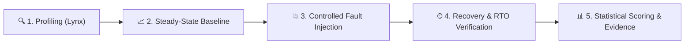
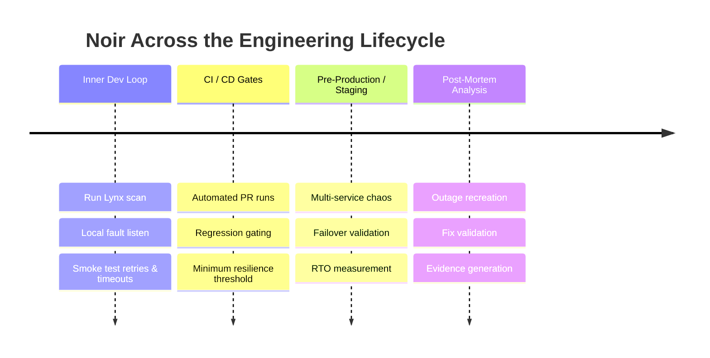
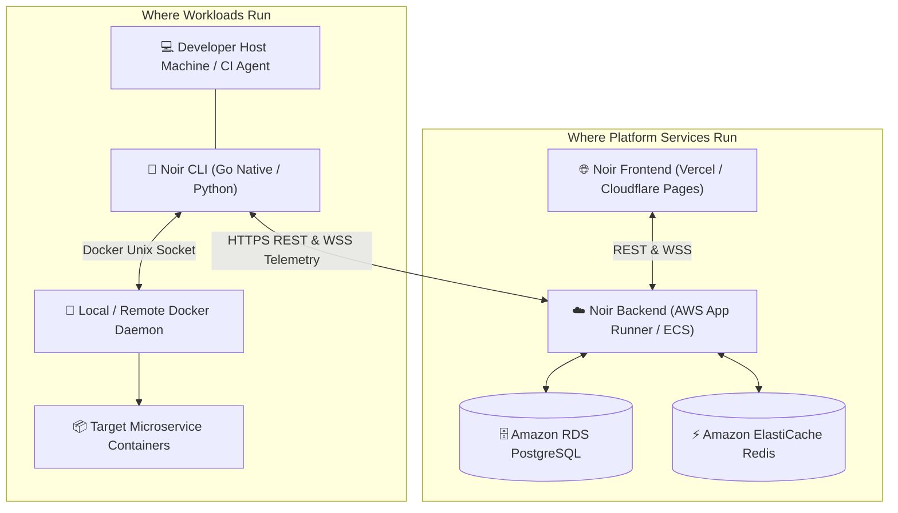

# 🌐 Noir System Overview: Architecture, Problem Domain & Operational Model

**Noir** is an autonomous, developer-first software reliability and chaos engineering platform designed for containerized applications and microservices. It bridges the gap between active fault injection and verifiable statistical evidence, transforming resilience testing from an infrequent, manual SRE chore into a continuous, automated phase of the modern software engineering lifecycle.

---

## 🗺 Quick System Matrix (5W1H)

| Dimension | Definition | Implementation in Noir |
| :--- | :--- | :--- |
| **WHAT** | An automated reliability & chaos engineering platform | Go Native / Python CLI Agent, Django Channels ASGI backend, and React 19 live telemetry dashboard. |
| **WHY** | Microservices pass unit tests but fail catastrophically in production | Validates circuit breakers, timeouts, retries, and fallback systems before code reaches production. |
| **WHEN** | Inner dev loop, CI/CD pull request gates, staging drills, post-mortems | Triggered ad-hoc via CLI (`noir run`), scheduled via web UI, or automated in CI pipelines. |
| **HOW** | Non-invasive AST scanning + Docker fault injection + steady-state probing | Lynx scanner identifies topology; agent injects network/resource faults, validates RTO, and streams live metrics. |
| **WHERE** | Developer workstations, CI runners, and cloud infrastructure | CLI runs locally against Docker; Backend runs on AWS (App Runner/ECS); Frontend hosted on Vercel. |

---

## 1. 🎯 The Problem Noir Solves (The "Why")

Modern cloud-native systems fail unpredictably. Traditional engineering workflows suffer from four systemic vulnerabilities that Noir directly eliminates:

```mermaid
graph TD
    subgraph Traditional Failures [The Traditional Dilemma]
        A["1. Unit & Integration Tests Pass in Perfect Conditions"] --> B["2. Transient Spikes & Latency Occur in Production"]
        B --> C["3. Unhandled Cascade Failures & Thread Starvation"]
        C --> D["4. Catastrophic Outage & Lengthy MTTR"]
    end

    subgraph Noir Remediation [The Noir Solution]
        E["1. Lynx Profiles Topology in Workspace"] --> F["2. Continuous Baseline Probing Established"]
        F --> G["3. Controlled Fault Injected into Target Containers"]
        G --> H["4. Statistically Validated Resilience Score & Remediation"]
    end

    Traditional Failures -.->|Replaced By| Noir Remediation
```

### 1. The "Healthy-State" Testing Fallacy
Standard testing suites (PyTest, Jest, Go tests) execute against deterministic, near-zero-latency local environments. They fail to validate:
* How services behave under **200ms downstream database latency**.
* Whether retry policies trigger **thundering herd storms** during 5% packet loss.
* Whether thread pools or memory leak during sudden **CPU exhaustion**.

### 2. High Barrier to Entry for Chaos Engineering
Existing chaos tools (Chaos Mesh, Gremlin, LitmusChaos) require complex Kubernetes clusters, daemonsets, and dedicated SRE teams. Solo engineers, small startups, and microservice developers cannot run them locally. Noir packages enterprise chaos engineering into a **single, zero-dependency CLI executable**.

### 3. Lack of Scientific Evidence & Statistical Rigor
Ad-hoc chaos tests often lack statistical baselines. If a test passes, engineers do not know if the system survived due to resilience or because the probe frequency was too low. Noir enforces:
* Explicit steady-state baseline measurement ($p50, p95, p99$ latency and error rates).
* Strict **sample-count confidence gating** (experiments with inadequate data are flagged `INCONCLUSIVE`).
* Exact **Recovery Time Objective (RTO)** validation requiring consecutive healthy confirmations.

### 4. Blast Radius Fear & Orphaned Configuration
Developers avoid chaos engineering because a broken injection script can leave network namespaces corrupted or host machines frozen. Noir guarantees **failsafe automated cleanup**: all traffic control rules and cgroups are restored even upon crash, unhandled exception, or SIGINT.

---

## 2. ⚡ What Noir Does (The "What")



### Core System Capabilities
1. **Zero-Dependency Static Workspace Profiling ([Lynx Engine](./02_lynx_engine_architecture.md))**:
   Inspects codebase structure, manifests, and import patterns in `<50ms` without executing untrusted code to detect runtimes, frameworks, and topologies.
2. **Deterministic Docker Fault Injection**:
   Manipulates Linux kernel Traffic Control (`netem`) and `cgroups` inside target containers to introduce latency, packet loss, bandwidth throttling, CPU burn, memory pressure, and container death.
3. **Continuous Steady-State Measurement**:
   Sends high-resolution HTTP health probes to monitor application availability, latency distributions, and status codes before, during, and after disruptions.
4. **Algorithmic Resilience Scoring**:
   Calculates scores ($0–100$) and assigns letter grades ($A$ through $F$) based on steady-state preservation, latency inflation factors, and recovery speed.
5. **Real-Time ASGI Telemetry Streaming**:
   WebSockets stream raw container logs, stdout/stderr, and probe events with sub-millisecond latency directly to the React terminal dashboard.
6. **Cross-Run Project Synthesis**:
   Aggregates multi-run chaos telemetry into collective project audit reports, highlighting systemic bottlenecks and recurring weaknesses.

---

## 3. ⏱ When Noir Is Used (The "When")

Noir operates across four distinct phases of the software development lifecycle:



| Lifecycle Stage | Typical Noir Workflow | Primary Objective |
| :--- | :--- | :--- |
| **Inner Dev Loop** | Developer runs `noir run` or `noir fault listen` on their laptop. | Test circuit breakers, fallback handlers, and connection timeouts while writing code. |
| **CI/CD Pull Request** | GitHub Actions / GitLab CI runs headless `noir run --headless`. | Prevent code regressions that degrade service resilience below an acceptable grade (e.g. Grade $B$). |
| **Pre-Production Audit** | SRE team triggers automated chaos scenarios from Noir Dashboard. | Verify that database disconnects and downstream delays do not cause complete application outages. |
| **Incident Post-Mortem** | Engineers reproduce past outages using exact fault parameters. | Scientifically confirm that architectural remediations prevent the incident from reoccurring. |

---

## 4. 🔄 How Noir Works (The "How")

### End-to-End Experiment Execution Flow

```mermaid
sequenceDiagram
    autonumber
    actor Dev as Developer / Engineer
    participant CLI as Noir CLI Agent (Host)
    participant DK as Docker Engine & Kernel
    participant App as Target Container
    participant API as Django REST Backend
    participant WS as Channels WebSocket Layer
    participant UI as React SPA Dashboard

    Dev->>CLI: noir run / noir fault listen
    CLI->>API: Authenticate & Claim Experiment Session
    API-->>CLI: Session Granted + Fault Specifications

    rect rgb(25, 35, 45)
    note over CLI, App: Phase 1: Steady-State Baseline
    loop Baseline Probing (5–10s)
        CLI->>App: HTTP Health Probes
        App-->>CLI: Status 200 (Latency recorded)
    end
    CLI->>API: Submit Baseline Telemetry (p50, p95, error_rate)
    end

    rect rgb(45, 25, 25)
    note over CLI, App: Phase 2: Controlled Fault Injection
    CLI->>DK: Apply Netem / Cgroups to Container
    DK->>App: Kernel throttles network / clamps resources
    loop Disruption Probing (Fault Duration)
        CLI->>App: HTTP Health Probes
        App-->>CLI: Degraded responses / timeouts
        CLI->>API: Stream Live Log Batches & Probe Metrics
        API->>WS: Broadcast Log Event
        WS->>UI: Real-Time Terminal & Chart Updates
    end
    end

    rect rgb(25, 45, 35)
    note over CLI, App: Phase 3: Rollback & Recovery Validation
    CLI->>DK: Tear down Netem rules / restore Cgroups
    DK->>App: Restore normal container operations
    loop Recovery Probing
        CLI->>App: Consecutive Health Check Probes
        App-->>CLI: Status 200 restored
    end
    note over CLI: Calculate RTO (Time until 3 consecutive 200 OKs)
    end

    CLI->>API: Submit Raw Observations & Experiment End
    API->>API: Evaluate Hypotheses & Compute Resilience Grade
    API->>UI: Final Resilience Report & Findings Ready
```



### Fault Injection Mechanisms
1. **Network Latency & Jitter**: Utilizes Linux Traffic Control (`tc qdisc add dev eth0 root netem delay <ms> <jitter>`) inside the container's network namespace.
2. **Packet Loss & Corruption**: Injects probabilistic packet drops (`netem loss <percentage>%`).
3. **CPU Saturation**: Executes lightweight in-container stress workers or tight computational loops to exhaust allocated CPU quotas.
4. **Memory Exhaustion**: Allocates memory pages dynamically up to the container limit to test behavior during Out-Of-Memory (`OOMKilled`) pressure.
5. **Container Termination / Restart**: Interacts with the Docker Engine daemon via Unix socket (`/var/run/docker.sock`) to test container restarts and recovery.

---

## 5. 📍 Where Noir Operates (The "Where")

Noir features a distributed deployment architecture separating local host execution from centralized cloud analytics:



* **Target Workspaces**: Any environment capable of running Docker (macOS, Linux, Windows WSL2, CI/CD runners like GitHub Actions).
* **Control Plane & APIs**: Hosted on AWS (`https://api.amalskumar.dev`) with auto-scaling container runtimes and Redis Channels for WebSocket pub/sub.
* **Web UI & Dashboard**: Hosted on edge CDN infrastructure (`https://noir.amalskumar.dev`) providing zero-latency dashboard access worldwide.

---

## 6. 📐 Mathematical & Measurement Model

Resilience in Noir is evaluated mathematically rather than heuristically. Every experiment measures empirical data against scientific thresholds:

### 1. Steady-State Baseline
Calculated during unperturbed operations prior to fault injection:
$$\mu_{baseline} = \frac{1}{N} \sum_{i=1}^N \text{latency}_i, \quad p95_{baseline} = \text{Percentile}_{95}(\text{latencies})$$

### 2. Disruption Latency Inflation
Measures how severely response times degraded under pressure:
$$\Delta L = \frac{p95_{fault} - p95_{baseline}}{p95_{baseline}}$$

### 3. Failure Rate Ratio
$$\text{FR} = \frac{N_{\text{failed probes}}}{N_{\text{total probes}}} \times 100\%$$

### 4. Recovery Time Objective (RTO)
The time delta between fault termination ($t_{fault\_end}$) and system recovery ($t_{healthy}$), where $t_{healthy}$ strictly requires $k$ consecutive successful probes (default: $k=3$):
$$\text{RTO} = t_{healthy} - t_{fault\_end}$$

### 5. Confidence Gating & Scoring Matrix
If the total sample count $N < N_{minimum}$ (e.g., test was aborted or container crashed instantly), the grade is flagged as **INCONCLUSIVE** to prevent false positives.

```
┌─────────────────┬─────────────────────────────────────────────────────────┐
│ Grade           │ Criteria                                                │
├─────────────────┼─────────────────────────────────────────────────────────┤
│ Grade A (90-100)│ FR = 0%, ΔL < 25%, RTO < 2s                             │
│ Grade B (80-89) │ FR < 5%, ΔL < 100%, RTO < 5s                            │
│ Grade C (70-79) │ FR < 15%, ΔL < 300%, RTO < 10s                          │
│ Grade D (60-69) │ FR < 30%, RTO < 20s (Degraded circuit breaker)          │
│ Grade F (0-59)  │ FR >= 30%, Unhandled exceptions, Cascading crash, RTO ∞ │
│ Inconclusive    │ Insufficient probe samples or unmonitored abort         │
└─────────────────┴─────────────────────────────────────────────────────────┘
```

---

## 7. 🔐 Security, Access Control & Safety Guardrails

### Multi-Tier Role-Based Access Control (RBAC)
* **Developers**: Can connect workspaces, trigger local test runs, and view project metrics.
* **Companies**: Manage enterprise workspaces, issue developer connection codes, invite team members, and review organizational compliance audits.
* **Platform Administrators**: Supervise system health, approve or reject corporate registrations, and oversee global system usage.

### Safety Failsafes
* **Deterministic Timeout Caps**: No chaos experiment can run indefinitely; all injections feature a hard stop timer (default: max 300 seconds).
* **Signal Trapping (`trap / defer`)**: Interrupting the CLI (`Ctrl+C`, `SIGTERM`, `SIGINT`) immediately invokes the teardown handler to remove traffic control rules and restart stopped containers.
* **OS Keyring Credential Storage**: Developer JWT tokens are never stored in plaintext on disk; they are encrypted using the native OS Keyring (Linux SecretService, macOS Keychain, Windows Credential Manager).

---

## 8. 📚 Further Reading & Deep Dives

To explore specific subsystems in depth, refer to the companion architecture specifications:

* [01. Authentication Architecture](./01_authentication_architecture.md) — JWT rotation, OS Keyring, OAuth2, and multi-tenant RBAC.
* [02. Lynx Profiler & Static Analysis Engine](./02_lynx_engine_architecture.md) — Heuristic scoring, AST scanning, and zero-dependency workspace profiling.
* [03. Backend Architecture & Telemetry Pipeline](./03_backend_architecture.md) — Django REST Framework, Channels WebSockets, and Redis pub/sub.
* [04. Project Roadmap & Implementation Milestones](./04_project_roadmap_and_milestones.md) — Completed milestones, active tasks, and upcoming capabilities.
