# 🔐 Noir Authentication Architecture — CLI, Frontend & Backend

This document details the end-to-end security, identity management, and authentication architecture implemented across the **Noir Platform**: the **Backend API**, the **React Frontend Dashboard**, and the **Noir CLI Agent**.

---

## 📐 End-to-End Authentication Architecture Diagram

```mermaid
sequenceDiagram
    autonumber
    actor Dev as Developer / User
    participant CLI as Noir CLI Agent
    participant FE as React Frontend
    participant BE as Django REST Backend
    participant KR as OS Keyring / LocalStorage

    rect rgb(30, 30, 45)
    note right of Dev: Option A: CLI Interactive Login
    Dev->>CLI: noir login
    CLI->>Dev: Prompt Email & Password
    CLI->>BE: POST /api/accounts/login/ {email, password}
    BE-->>CLI: 200 OK {access, refresh, user}
    CLI->>KR: Save access & refresh tokens to OS Keyring (service='noir')
    end

    rect rgb(20, 40, 30)
    note right of Dev: Option B: Frontend Browser Login
    Dev->>FE: Enter Credentials on Login Page
    FE->>BE: POST /api/accounts/token/ {username/email, password}
    BE-->>FE: 200 OK {access, refresh}
    FE->>KR: Save tokens to LocalStorage
    FE->>BE: GET /api/accounts/me/ (Bearer Access Token)
    BE-->>FE: 200 OK User Profile & Role Info
    end

    rect rgb(45, 30, 30)
    note right of Dev: Option C: Automatic Token Refresh (CLI / Frontend)
    CLI->>BE: GET /api/projects/my/ (Expired Bearer Token)
    BE-->>CLI: 401 Unauthorized
    CLI->>BE: POST /api/accounts/token/refresh/ {refresh}
    BE-->>CLI: 200 OK {access, refresh (rotated)}
    CLI->>KR: Save updated token pair
    CLI->>BE: Retry original GET /api/projects/my/
    BE-->>CLI: 200 OK Response Data
    end
```



---

## 🛠 1. Backend Authentication Architecture (`apps.accounts`)

The Django REST Framework backend uses `rest_framework_simplejwt` with enhanced custom serializers for role protection, token rotation, and blacklisting.

### A. Token Lifetimes & Security Configuration (`backend/settings.py`)
- **Access Token Lifetime**: 30 Minutes (`ACCESS_TOKEN_LIFETIME = timedelta(minutes=30)`)
- **Refresh Token Lifetime**: 12 Days (`REFRESH_TOKEN_LIFETIME = timedelta(days=12)`)
- **Token Rotation**: `ROTATE_REFRESH_TOKENS = True` (A new refresh token is issued whenever the old one is refreshed).
- **Token Blacklisting**: `BLACKLIST_AFTER_ROTATION = True` (`rest_framework_simplejwt.token_blacklist` invalidates old refresh tokens upon rotation or logout).

### B. Role-Based Access Control (RBAC) & Models (`apps/accounts/models.py`)
- **User Roles**:
  - `Role.DEVELOPER`: Default role for standard engineers and developers.
  - `Role.COMPANY`: Corporate organization account linked to a `CompanyProfile`.
- **Company Approval Status**:
  - `Status.PENDING`: Newly registered company awaiting administrator verification.
  - `Status.APPROVED`: Active corporate account with full access to company dashboards and developer team management.
  - `Status.REJECTED`: Registration request denied by administrator.

### C. Self-Healing Role Integrity
To prevent orphaned roles (e.g. users assigned role `company` without a valid `CompanyProfile`), the backend implements self-healing logic across authentication serializers:
- **`RegisterSerializer`**: Enforces `role = "developer"` by default unless explicitly creating an enterprise profile.
- **`EmailTokenObtainPairSerializer` & `/api/accounts/me/`**: Automatically downgrades a user's role to `developer` if `role == 'company'` but no `CompanyProfile` object exists in the database.

### D. Backend Authentication API Endpoints
| Endpoint | Method | Authentication | Function & Details |
| :--- | :--- | :--- | :--- |
| `/api/accounts/token/` | `POST` | Public | Authenticates user with username/email & password; returns `{access, refresh}`. |
| `/api/accounts/login/` | `POST` | Public | Dual email/username CLI login endpoint. |
| `/api/accounts/token/refresh/` | `POST` | Public (Refresh) | Accepts valid refresh token, blacklists it, and issues new token pair. |
| `/api/accounts/logout/` | `POST` | Bearer Token | Blacklists provided refresh token and invalidates active session. |
| `/api/accounts/me/` | `GET` | Bearer Token | Returns detailed current user identity, role, and company verification status. |
| `/api/accounts/register/` | `POST` | Public | Registers new developer or company account with validation. |
| `/api/accounts/social-auth/` | `POST` | Public | Callback endpoint for Google & GitHub OAuth code exchange. |

---

## 🌐 2. Frontend Authentication Architecture (`frontend/src/`)

The React Single Page Application manages user sessions dynamically with automatic token injection, role-based route protection, and proactive error recovery.

### A. Token Persistence & HTTP Interceptor (`frontend/src/utils/api.ts`)
- **Storage**: Access and refresh tokens are persisted in `localStorage` under `access_token` and `refresh_token`.
- **Global `apiFetch` Interceptor**:
  - Automatically inspects outgoing requests and attaches `Authorization: Bearer <access_token>` headers.
  - Intercepts rate-limiting HTTP 429 errors and provides cached GET fallback data.

### B. Protected Route Guards (`frontend/src/components/ProtectedRoute.tsx`)
Routes are secured using higher-order wrapper components enforcing authentication and role verification:

```tsx
<ProtectedRoute requiredRole="company">
  <CompanyDashboard />
</ProtectedRoute>
```

- **Unauthenticated Users**: Automatically redirected to `/login`.
- **Pending / Rejected Company Accounts**: Users with `role === "company"` whose status is `PENDING` or `REJECTED` are automatically redirected to `/company/status` to prevent unauthorized access to enterprise features.
- **Role Mismatch**: Developers attempting to access `/company/*` routes are redirected to their developer `/dashboard`.

---

## 💻 3. CLI Agent Authentication Architecture (`agent/noir/`)

The Python CLI agent provides secure credential management without relying on insecure plaintext config files.

### A. OS Keyring Storage (`agent/noir/auth/storage.py`)
Noir uses the system native **Keyring** service (e.g. Keychain on macOS, SecretService/KWallet on Linux, Credential Manager on Windows) under the service name `noir`:

```python
import keyring

SERVICE = "noir"

def save_token(token: dict):
    keyring.set_password(SERVICE, "access", token["access"])
    keyring.set_password(SERVICE, "refresh", token["refresh"])

def get_access_token():
    return keyring.get_password(SERVICE, "access")
```

### B. Automatic Background Token Refresh (`agent/noir/api/client.py`)
All CLI requests to the backend pass through `ApiClient.send_request_to_backend()`. If the backend returns `HTTP 401 Unauthorized`:
1. `ApiClient` intercepts the `401` status code.
2. Performs an automated POST request to `/accounts/token/refresh/` using `get_refresh_token()`.
3. Overwrites the expired credentials in Keyring with the newly issued token pair.
4. Transparently retries the original API request without interrupting the user's terminal workflow!

### C. CLI Authentication Commands
- **`noir login`**: Interactive CLI authentication prompting for email and password.
- **`noir logout`**: Deletes stored tokens from system Keyring and notifies backend to blacklist refresh tokens.
- **`noir whoami`**: Fetches user identity (`/api/accounts/me/`) and prints a formatted terminal overview box.

---

## 🎯 Summary Matrix of Auth Features

| Feature | Backend (Django) | Frontend (React) | CLI Agent (Python) |
| :--- | :--- | :--- | :--- |
| **Token Mechanism** | SimpleJWT (HS256) | Bearer Header | Bearer Header |
| **Storage Medium** | Database / Blacklist | `localStorage` | OS Native Keyring |
| **Token Rotation** | Enforced | Auto-Refresh | Auto-Refresh on 401 |
| **Role Protection** | Custom Permissions | `ProtectedRoute` Guard | API Response Handling |
| **OAuth Support** | GitHub & Google | Browser Redirection | System Browser Launch |
