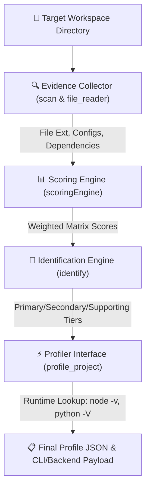

# 🐾 Lynx Profiler & Static Analysis Engine Architecture

The **Lynx Engine** (`agent/noir/lynx_engine/`) is Noir's custom-built, zero-dependency static analysis engine. It performs ultra-fast workspace inspection to detect tech stacks, primary languages, frameworks, package managers, build tools, and third-party libraries without executing un-sandboxed code.

---

## 🏗 High-Level Lynx Pipeline Architecture



---

## 🧩 Internal Modules Breakdown

### 1. Evidence Collector (`evidence_collector.py`)
The Evidence Collector recursively inspects file structures while ignoring standard build artifacts (`.git`, `node_modules`, `venv`, `__pycache__`, `dist`).

- **Fast Directory Scanning**: Uses high-performance native `os.scandir` to traverse the directory tree.
- **Extension & File Registry**: Tracks file extensions (`.py`, `.ts`, `.tsx`, `.rs`, `.go`) and configuration files (`manage.py`, `package.json`, `Cargo.toml`, `go.mod`, `pom.xml`, `composer.json`).
- **Dependency Keyword Detection**: Reads key manifest files and scans for dependency signatures defined in `DEPENDENCY_KEYWORDS` using pre-compiled word regex matching (`WORD_RE`).

### 2. Data & Rules Registry (`data.py`)
Contains the knowledge base and heuristic weight matrices used by Lynx:
- **`IGNORE`**: Set of directories ignored during recursive tree traversal.
- **`STACK_EVIDENCE`**: File-to-stack weighting maps (e.g. `manage.py` → Django (+10), `next.config.js` → Next.js (+10), `vite.config.ts` → Vite (+8)).
- **`DEPENDENCY_KEYWORDS`**: Mapping of package/import names to specific tech stack identifiers (e.g., `@angular/core` → Angular, `django-rest-framework` → Django, `tokio` → Rust Async).

### 3. Scoring Engine (`scoring_engine.py`)
Converts raw evidence counts into relative weight scores:
- Normalizes file extension occurrences to prevent large asset folders (e.g. 100 HTML files) from drowning out primary logic files.
- Aggregates file weights, dependency match scores, and directory structure hints into a unified `scores` dictionary.

### 4. Identification Engine (`identification_engine.py`)
Analyzes calculated score matrices and categorizes technologies into distinct confidence tiers:
- **Primary Language**: Dominant programming language driving the codebase.
- **Framework Identification**: Highest-scoring web or application framework (e.g. React, Django, FastAPI, Next.js, Spring Boot, Express).
- **Secondary & Supporting Stack**: Secondary languages (e.g. TypeScript alongside HTML/CSS) and dev build tools (Docker, Vite, Webpack).

### 5. Profiler Orchestrator (`profiler.py`)
The public entry point exposed to the Noir CLI (`profile_project(path)`):
- Executes `scan()` -> `scoringEngine()` -> `IdentificationEngine()`.
- Queries system runtime versions dynamically (`python --version`, `node -v`, `go version`, `rustc --version`).
- Detects package managers (`uv`, `npm`, `yarn`, `pnpm`, `pip`, `poetry`, `cargo`).
- Returns a clean Python dictionary suitable for terminal display tables and backend REST profile sync (`/api/projects/<id>/profile/`).

---

## 📊 Sample Lynx Output Payload

```json
{
    "framework_name": "Django",
    "language": "Python",
    "runtime_version": "3.11.4",
    "package_manager": "pip",
    "operating_system": "Linux (x86_64)",
    "raw_results": {
        "frameworks": {
            "django": 42
        },
        "language": {
            "primary": ["python"],
            "supporting": ["html", "css"]
        },
        "package_managers": {
            "pip": 15
        }
    }
}
```

---

## ⚡ Performance Features

1. **Non-Blocking Parsing**: Uses `errors="ignore"` streaming file reads to handle large codebases without choking on non-UTF8 binary files.
2. **Zero-Dependency Core**: Operates purely using Python standard library modules (`os`, `re`, `platform`, `subprocess`, `pathlib`).
3. **Instant Cache Persistence**: Saves analysis results locally to `.noir/cache/analysis.json` for fast offline retrieval.
