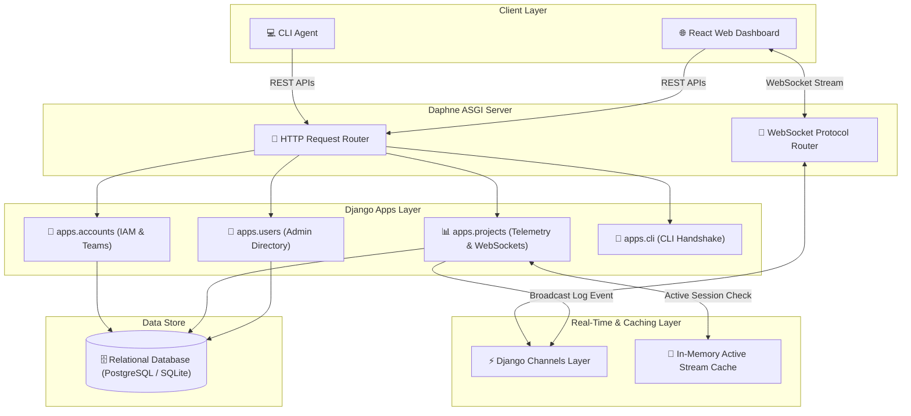
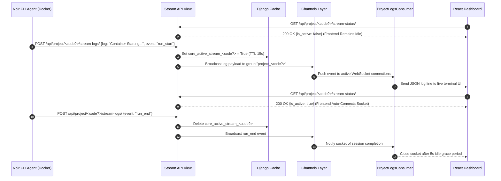

# ⚡ Backend System Architecture & Technology Stack

This document provides a deep architectural breakdown of the **Noir Backend** (`backend/`), detailing every technology used, the engineering rationale behind each design choice, how internal subsystems interact, and how data flows through HTTP REST endpoints and real-time ASGI WebSockets.

---

## 🏛 High-Level Backend Architecture Diagram

---

## 🛠 Technology Stack & Engineering Rationale

| Technology | Role / Usage | Why We Used It (Engineering Rationale) |
| :--- | :--- | :--- |
| **Python 3.11+** | Primary Language | Offers high productivity, robust AST/static analysis tools, rich library support, and effortless integration with machine learning and developer tools. |
| **Django 6.0+** | Core Backend Framework | Chosen for its "batteries-included" philosophy: high-grade security (SQL injection protection, CSRF, XSS prevention), powerful ORM, built-in migration system, and mature ecosystem. |
| **Django REST Framework (DRF)** | Web API Toolkit | Provides clean serialization, class-based views (CBVs), declarative permission policies, customizable pagination, and fine-grained rate limiting (throttling). |
| **Daphne & Django Channels (ASGI)** | Real-Time Engine & WebSockets | Standard Django WSGI is synchronous. We integrated ASGI with Daphne and Django Channels to handle long-lived WebSocket connections concurrently for live log streaming without blocking HTTP request threads. |
| **SimpleJWT (`rest_framework_simplejwt`)** | Identity & Security | Stateless, scalable authentication. We configured 30-minute access tokens and 12-day refresh tokens with automated token rotation and database blacklisting for instant session termination on logout. |
| **PostgreSQL / SQLite** | Relational Database | Guarantees transactional consistency across multi-table relations (Users, Companies, Teams, Projects, Test Runs). Uses native `JSONField` for flexible Lynx AST profiler reports. |
| **Django Cache Framework** | Stream Activity Tracking | Uses lightweight server-side caching to track active CLI container log streams (`core_active_stream_<code?>`). This allows frontend clients to poll stream status and remain idle when CLI is inactive. |
| **django-cors-headers** | Cross-Origin Security | Enables granular CORS headers allowing secure API calls from developer web dashboards running on isolated frontend origins. |

---

## 🔍 Internal Layering & Component Architecture

### 1. Data Layer — ORM Models (`apps/*/models.py`)
- **Accounts (`apps.accounts`)**:
  - `User`: Customized `AbstractUser` supporting `developer` vs `company` roles.
  - `CompanyProfile`: Corporate entity model tracking verification state (`PENDING`, `APPROVED`, `REJECTED`), tax ID, website, logo, and phone.
  - `DeveloperTeam`: Cross-functional team entity linking companies, developer members, and projects.
  - `Notification`: System and organization notifications (invitations, role updates).
- **Projects (`apps.projects`)**:
  - `Project`: Workspaces indexed by unique connection code (e.g. `NR-KO2Y3DZZ`), visibility (`public`/`private`), and deployment mode (`monolith`/`microservice`).
  - `ProjectProfile`: Lynx AST scanner reports (`JSONField` storage for dependencies, runtime version, package manager).
  - `TestRun`: Historical logs and metrics (passed, failed, skipped, duration in ms) for every test run executed via `noir test` or `noir run`.
  - `Framework`: Detection templates for web frameworks (Django, React, FastAPI, Next.js, Express, Pytest).

### 2. Request & Security Pipeline (HTTP REST)
Every HTTP request follows a strict security pipeline:
1. **CORS Middleware**: Validates origin headers.
2. **Authentication Middleware**: Resolves `Authorization: Bearer <access_token>` into `request.user`.
3. **Throttling Layer**: Enforces rate limits defined in `REST_FRAMEWORK["DEFAULT_THROTTLE_RATES"]` (`1200/min` for authenticated users, `300/min` for anonymous clients, `10/min` for login/registration).
4. **Permission Guard**: Verifies `IsAuthenticated` or `IsAdmin` policies.
5. **View / Serializer Execution**: Performs validation, ORM operations, and returns standardized JSON responses.

### 3. Real-Time Telemetry Pipeline (ASGI Channels & WebSockets)

---

## ⚡ Performance Optimizations Implemented

1. **On-Demand WebSocket Activation**: Rather than keeping open WebSocket connections idling 24/7 (which consumes server RAM and socket descriptors), the frontend polls `/api/project/<code?>/stream-status/` every 3s and opens a socket ONLY when an active CLI run is detected.
2. **Selective Database Indexes**: Added database indexes (`db_index=True`) on frequently searched fields like `Project.status` and `Project.connection_code`.
3. **Atomic Transactions & Token Blacklisting**: Uses Django DB transactions for sensitive registration and token rotation actions, preventing race conditions or partial database writes.
