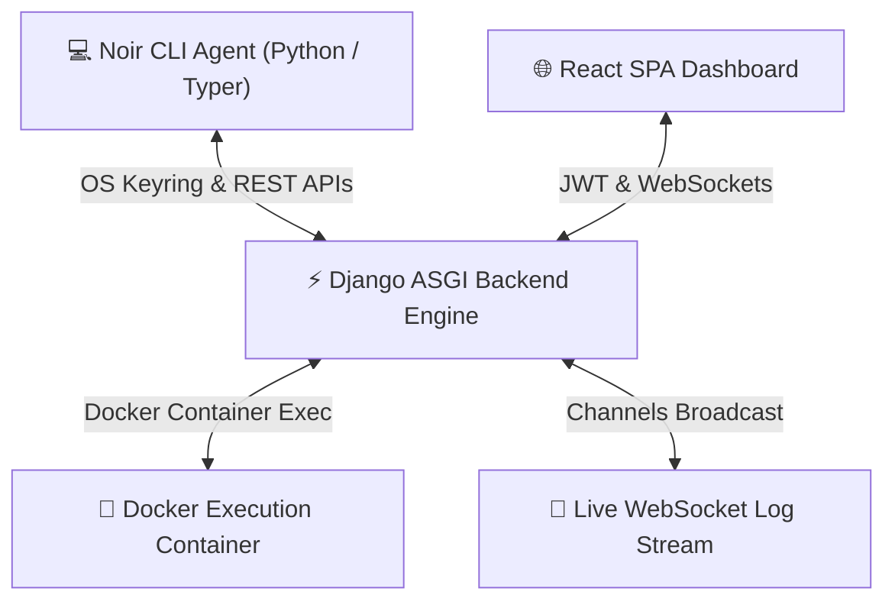

# 📚 Noir Platform — Architecture Documentation Index

Welcome to the comprehensive architecture and engineering documentation for **Noir**, the AI-powered Software Reliability Engineering platform.

---

## 🗺 Documentation Map

| Module | Document | Description |
| :--- | :--- | :--- |
| **01. Authentication** | [Authentication Architecture](./01_authentication_architecture.md) | End-to-end multi-layer auth (JWT rotation, OS Keyring, RBAC, OAuth, Self-healing roles) |
| **02. Lynx AST Engine** | [Lynx Profiler Architecture](./02_lynx_engine_architecture.md) | Zero-dependency static analysis engine, heuristic scoring, framework detection |
| **03. Backend Architecture** | [Backend API & Telemetry Engine](./03_backend_architecture.md) | Django REST Framework architecture, Models, Channels WebSockets, Rationale & Data Flow |
| **04. Roadmap & Milestones** | [Project Roadmap & Vision](./04_project_roadmap_and_milestones.md) | What we built, immediate next tasks, and long-term "nice-to-have" product features |
| **05. CLI Agent Engine** | [CLI Agent Engine](../agent/README.md) | Python CLI architecture, Lynx AST profiler, Docker container exec stream engine |
| **06. Frontend App** | [Frontend Dashboard Overview](../frontend/README.md) | React, Tailwind, Recharts analytics, WebSocket live terminal, onboarding workflows |

---

## 🏛 System Architecture Overview

---

## 🚀 Quick Navigation & Highlights

- **Unified Identity**: Developers and Companies authenticate seamlessly across the CLI Agent, Web Frontend, and REST Backend.
- **Lynx Static Engine**: High-speed, non-intrusive workspace scanner identifying languages, frameworks, and tools in under 50ms.
- **ASGI WebSockets**: Real-time channel broadcasting for live container output with on-demand stream status polling.
- **Enterprise Access Control**: Role-Based Access Control (RBAC) with corporate verification statuses (`PENDING`, `APPROVED`, `REJECTED`).
