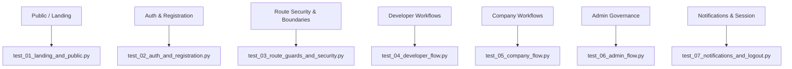

# Noir Selenium E2E Testing Guide

Comprehensive guide and operational manual for configuring, executing, debugging, and extending the Selenium End-to-End (E2E) testing framework for the Noir reliability and chaos engineering platform.

---

## Table of Contents

1. [Architecture & Framework Overview](#1-architecture--framework-overview)
2. [Prerequisites & System Requirements](#2-prerequisites--system-requirements)
3. [Environment Configuration & Variables](#3-environment-configuration--variables)
4. [Step-by-Step Setup Guide](#4-step-by-step-setup-guide)
5. [Running Tests](#5-running-tests)
   - [Method A: All-in-One CLI Runner (`run_tests.py`)](#method-a-all-in-one-cli-runner-run_testspy)
   - [Method B: Direct Pytest Execution](#method-b-direct-pytest-execution)
   - [Running Specific Suites & Test Cases](#running-specific-suites--test-cases)
   - [Headless vs. Headed (Graphical) Mode](#headless-vs-headed-graphical-mode)
   - [Cross-Browser Execution](#cross-browser-execution)
6. [Test Suites & Coverage Map](#6-test-suites--coverage-map)
7. [Authentication & Database Seeding](#7-authentication--database-seeding)
8. [Writing New Tests with the Page Object Model (POM)](#8-writing-new-tests-with-the-page-object-model-pom)
9. [Reports, Logs, and Failure Screenshots](#9-reports-logs-and-failure-screenshots)
10. [Troubleshooting & Common Issues](#10-troubleshooting--common-issues)

---

## 1. Architecture & Framework Overview

The test directory (`test/`) contains an enterprise-grade automated browser testing suite tailored to Noir's multi-role web application. It automates user interactions across three main roles (**Developer**, **Company**, and **Admin**) as well as public workflows.

```
test/
├── instruction/
│   └── README.md                         # This comprehensive guide
├── README.md                             # Quick reference & overview
├── requirements.txt                      # Dependencies (selenium, pytest, pytest-html)
├── config.py                             # URLs, timeouts, test credentials, browser config
├── conftest.py                           # Pytest fixtures, driver lifecycle, auto-screenshots
├── run_tests.py                          # Unified CLI test runner with health checks & aliases
├── test_experiment_engine.py             # Pure-Python unit/integration tests for chaos engine
├── reports/
│   ├── report.html                       # Generated HTML test execution report
│   ├── test_cert.pdf                     # Fixture PDF for company verification upload
│   └── screenshots/                      # Auto-captured screenshots upon test failures
├── utils/
│   ├── driver_factory.py                 # Multi-browser WebDriver builder (Firefox, Chrome, Brave)
│   ├── helpers.py                        # Explicit waits, safe click, input filler, token injector
│   └── seed_data.py                      # Automated Django test database seeder
├── pages/                                # Page Object Model (POM) abstractions
│   ├── base_page.py                      # Base page with robust wait & action wrappers
│   ├── home_page.py                      # Landing page, navigation, hero CTAs
│   ├── contact_page.py                   # Contact form & submission confirmation
│   ├── login_page.py                     # Login form, password toggle, live validation
│   ├── register_page.py                  # Developer & Company registration, file upload
│   ├── developer_pages.py                # Dashboard, project creation, chaos experiments
│   ├── company_pages.py                  # Company portal, verification banner, developers
│   └── admin_pages.py                    # Admin panel, user management, company approvals
└── suites/                               # Test suite modules
    ├── test_01_landing_and_public.py     # Public pages, navigation, contact, 404
    ├── test_02_auth_and_registration.py  # Auth flows, live validation, company doc upload
    ├── test_03_route_guards_and_security.py # Route guards, role boundaries, token expiry
    ├── test_04_developer_flow.py        # Project CRUD, chaos runs, analytics
    ├── test_05_company_flow.py          # Company dashboard, verification workflow
    ├── test_06_admin_flow.py            # User management, company document verification
    └── test_07_notifications_and_logout.py # Notifications, session invalidation, logout
```

---

## 2. Prerequisites & System Requirements

### Python & System Packages
- **Python 3.10+** (Python 3.11, 3.12, 3.13, 3.14 supported).
- **Virtual Environment**: Use the project's backend virtual environment located at `backend/venv/` or create a dedicated virtualenv.

### Supported Web Browsers
1. **Mozilla Firefox** (Default & recommended on Linux):
   - Installed at `/usr/bin/firefox`.
   - Driver management: Selenium 4+ automatically downloads and configures `geckodriver`.
2. **Google Chrome / Chromium**:
   - Installed at `/usr/bin/google-chrome` or `/usr/bin/chromium`.
   - Driver management: Selenium 4+ automatically manages `chromedriver`.
3. **Brave Browser**:
   - Automatically detected at `/usr/bin/brave` or `/usr/bin/brave-browser`.

### Active Application Services
Both the backend and frontend services must be running before running E2E tests:

| Service | Default URL | Command to Start |
|---|---|---|
| **Backend API (Django)** | `http://localhost:8000` | `./backend/venv/bin/python backend/manage.py runserver 0.0.0.0:8000` |
| **Frontend UI (React/Vite)** | `http://localhost:3000` | `cd frontend && npm run dev` |

---

## 3. Environment Configuration & Variables

All core settings are defined in [`test/config.py`](file:///home/amalskumar/projects/College%20Projects/Continues/noir/test/config.py) and can be customized via environment variables:

| Environment Variable | Default Value | Description |
|---|---|---|
| `NOIR_FRONTEND_URL` | `http://localhost:3000` | URL where the React/Vite frontend is served |
| `NOIR_BACKEND_URL` | `http://localhost:8000` | URL where the Django backend API is served |
| `NOIR_BROWSER` | `firefox` | Browser engine: `firefox`, `chrome`, or `brave` |
| `NOIR_HEADLESS` | `true` | Run browser in headless mode (`true`/`false`) |
| `NOIR_WINDOW_WIDTH` | `1920` | Browser viewport width in pixels |
| `NOIR_WINDOW_HEIGHT` | `1080` | Browser viewport height in pixels |
| `NOIR_TIMEOUT` | `10` | Default explicit wait timeout in seconds |

---

## 4. Step-by-Step Setup Guide

### Step 1: Install Test Dependencies

Install the required Python packages into your active virtual environment:

```bash
# Using the backend virtual environment (recommended)
./backend/venv/bin/pip install -r test/requirements.txt
```

*Requirements include:*
- `selenium>=4.20.0`
- `pytest>=8.0.0`
- `pytest-html>=4.1.0`

### Step 2: Start Application Services

Open two separate terminals (or background tasks) to launch the backend and frontend:

**Terminal 1 — Backend:**
```bash
./backend/venv/bin/python backend/manage.py runserver 0.0.0.0:8000
```

**Terminal 2 — Frontend:**
```bash
cd frontend && npm run dev
```

### Step 3: Verify Services Health

Check that both services are online and responding using the built-in health check flag:

```bash
./backend/venv/bin/python test/run_tests.py --check-services
```

Expected output:
```text
==========================================
  SERVICE HEALTH STATUS
==========================================
  Backend  (http://localhost:8000):  ONLINE
  Frontend (http://localhost:3000): ONLINE
==========================================
```

---

## 5. Running Tests

### Method A: All-in-One CLI Runner (`run_tests.py`)

The test runner script [`test/run_tests.py`](file:///home/amalskumar/projects/College%20Projects/Continues/noir/test/run_tests.py) handles database seeding, health checks, argument parsing, and execution report generation.

#### 1. Run all E2E test suites (Headless)
```bash
./backend/venv/bin/python test/run_tests.py
```

#### 2. Run with service health verification and generate HTML report
```bash
./backend/venv/bin/python test/run_tests.py --check-services --report
```
The resulting report is saved to `test/reports/report.html`.

#### 3. Run a specific test suite
Use the `--suite` flag with any of the following suite names or aliases:

| Suite Name | Target File | Description |
|---|---|---|
| `public` (alias: `contact`) | `test/suites/test_01_landing_and_public.py` | Landing page, navigation bar, contact form, 404 |
| `auth` | `test/suites/test_02_auth_and_registration.py` | Live form validation, login, registration, doc upload |
| `security` | `test/suites/test_03_route_guards_and_security.py` | Route guards, unauthorized access, cross-role isolation |
| `developer` | `test/suites/test_04_developer_flow.py` | Developer dashboard, project creation, chaos runs |
| `company` | `test/suites/test_05_company_flow.py` | Company dashboard, document verification status |
| `admin` | `test/suites/test_06_admin_flow.py` | Admin dashboard, user management, company document review |
| `logout` (alias: `notifications`) | `test/suites/test_07_notifications_and_logout.py` | Notifications dropdown, token revocation, logout |
| `all` (default) | `test/suites/` | Executes all 7 test suites sequentially |

Example:
```bash
# Run only developer workflow tests
./backend/venv/bin/python test/run_tests.py --suite developer

# Run only authentication & registration tests
./backend/venv/bin/python test/run_tests.py --suite auth
```

---

### Method B: Direct Pytest Execution

You can run `pytest` directly from the workspace root. Ensure `PYTHONPATH=.` is set so the local `test` package is discovered correctly:

```bash
# Run all suites
PYTHONPATH=. ./backend/venv/bin/pytest test/suites -v

# Run a single suite file
PYTHONPATH=. ./backend/venv/bin/pytest test/suites/test_02_auth_and_registration.py -v

# Run a specific test function
PYTHONPATH=. ./backend/venv/bin/pytest test/suites/test_04_developer_flow.py -k "test_create_project" -v
```

---

### Headless vs. Headed (Graphical) Mode

By default, tests run in **headless** mode (no browser window appears), which is faster and suitable for CI and terminal sessions.

To watch the browser perform clicks and navigate in a visible graphical window:

```bash
# Using run_tests.py
./backend/venv/bin/python test/run_tests.py --suite developer --headed

# Using pytest directly
PYTHONPATH=. ./backend/venv/bin/pytest test/suites/test_04_developer_flow.py --headed -s -v
```

---

### Cross-Browser Execution

Switch between Firefox, Chrome, and Brave using the `--browser` flag:

```bash
# Run in Firefox (default)
./backend/venv/bin/python test/run_tests.py --browser firefox

# Run in Google Chrome / Chromium
./backend/venv/bin/python test/run_tests.py --browser chrome

# Run in Brave Browser
./backend/venv/bin/python test/run_tests.py --browser brave
```

Or set the environment variable:
```bash
export NOIR_BROWSER=chrome
./backend/venv/bin/python test/run_tests.py
```

---

## 6. Test Suites & Coverage Map

The test suite covers over 48 test assertions across every critical path in Noir:



### Key Areas Tested
1. **Public & Landing (`test_01`)**:
   - Navigation links, hero banner, call-to-actions.
   - Interactive contact form submission and response validation.
   - 404 page rendering on unknown routes.
2. **Authentication & Registration (`test_02`)**:
   - Live client-side email format validation with real-time feedback.
   - Password strength indicator (Weak, Medium, Strong) & length enforcement.
   - Password confirmation match validation.
   - Company registration with Tax ID / Registration number validation.
   - Incorporation certificate upload (PDF) via [`test/reports/test_cert.pdf`](file:///home/amalskumar/projects/College%20Projects/Continues/noir/test/reports/test_cert.pdf).
3. **Route Guards & Boundaries (`test_03`)**:
   - Redirect unauthenticated users from `/dashboard` or `/admin` to `/login`.
   - Prevent Developer users from accessing Admin (`/admin`) or Company (`/company`) routes.
   - Prevent Company users from accessing Developer-only pages.
   - `PublicOnlyRoute` redirecting authenticated users away from `/login` and `/register`.
4. **Developer Workflows (`test_04`)**:
   - Dashboard statistics cards and project list.
   - Project creation modal (repository URL, project name, environment).
   - Chaos experiment dashboard, telemetry metrics, and report view.
5. **Company Workflows (`test_05`)**:
   - Company overview dashboard and verification status banner (Pending / Approved).
   - Developers directory and company project list.
6. **Admin Governance (`test_06`)**:
   - User directory table and role filters.
   - Company verification modal: review Tax ID and download business certificate document.
   - Approving and rejecting company registrations.
7. **Session Invalidation & Logout (`test_07`)**:
   - User notifications menu toggle.
   - Logout action: clearing JWT access/refresh tokens in `localStorage`.
   - Browser back-button protection after logging out.

---

## 7. Authentication & Database Seeding

### Pre-Seeded Accounts
The test framework provisions deterministic seed data into the database before test execution via [`test/utils/seed_data.py`](file:///home/amalskumar/projects/College%20Projects/Continues/noir/test/utils/seed_data.py):

| Role | Username | Email | Password | Details |
|---|---|---|---|---|
| **Developer** | `tester` | `tester@noir.ai` | `testpass123` | Active developer with seeded projects |
| **Company** | `velora_company` | `company@noir.ai` | `testpass123` | Company admin for "Velora Tech" |
| **Admin** | `admin` | `admin@noir.ai` | `testpass123` | Superuser / staff member |

### Fast Authentication via `auth_driver` Fixture
Instead of going through the UI login form before every single test (which would slow down test runs significantly), tests use the `auth_driver` fixture. This fixture generates a real JWT token from Django and injects it directly into `localStorage`, instantly authenticating the browser session:

```python
def test_developer_dashboard(auth_driver):
    # Automatically logs in as developer and opens frontend URL
    driver, tokens = auth_driver("developer")
    
    # Ready to test protected pages immediately
    driver.get(f"{config.FRONTEND_URL}/dashboard")
```

To manually seed the database at any time:
```bash
./backend/venv/bin/python test/utils/seed_data.py
```

---

## 8. Writing New Tests with the Page Object Model (POM)

All UI interactions should be encapsulated within Page Objects in `test/pages/`. Tests in `test/suites/` should only call semantic actions on these page objects.

### Step 1: Create or Update a Page Object (`test/pages/my_page.py`)

Inherit from `BasePage` in [`test/pages/base_page.py`](file:///home/amalskumar/projects/College%20Projects/Continues/noir/test/pages/base_page.py):

```python
from selenium.webdriver.common.by import By
from test.pages.base_page import BasePage

class MyFeaturePage(BasePage):
    # Define locators as tuples: (By, selector)
    SUBMIT_BUTTON = (By.CSS_SELECTOR, "button[type='submit']")
    STATUS_BADGE = (By.ID, "status-badge")
    INPUT_NAME = (By.NAME, "name")

    def enter_name(self, name: str):
        # Uses built-in explicit wait and clear before typing
        return self.fill_input(self.INPUT_NAME, name)

    def click_submit(self):
        # Uses retry logic and auto-scrolls into view
        self.safe_click(self.SUBMIT_BUTTON)

    def get_status_text(self) -> str:
        badge = self.wait_for_element(self.STATUS_BADGE)
        return badge.text
```

### Step 2: Write the Test in a Suite (`test/suites/test_my_feature.py`)

```python
import pytest
from test import config
from test.pages.my_page import MyFeaturePage

def test_my_feature_submission(auth_driver):
    # 1. Obtain an authenticated driver as developer
    driver, _ = auth_driver("developer")
    
    # 2. Navigate to feature route
    driver.get(f"{config.FRONTEND_URL}/dashboard/my-feature")
    
    # 3. Use Page Object
    page = MyFeaturePage(driver)
    page.enter_name("Resilience-Check-01")
    page.click_submit()
    
    # 4. Assert outcome
    assert page.get_status_text() == "Active"
```

### Best Practices:
- **No hardcoded `time.sleep()`**: Always rely on Selenium's `WebDriverWait` and explicit condition helpers (`wait_for_element`, `wait_for_clickable`, `wait_for_url_contains`).
- **Use `safe_click()`**: Intercepted clicks or animated elements are automatically handled by `safe_click()` with automatic fallback to JavaScript clicks.
- **Unique Selectors**: Prefer `id`, `data-testid`, or unambiguous CSS selectors over long and brittle XPath chains.

---

## 9. Reports, Logs, and Failure Screenshots

### Automated Failure Screenshots
When any test fails, the `driver` fixture in [`test/conftest.py`](file:///home/amalskumar/projects/College%20Projects/Continues/noir/test/conftest.py) automatically captures a full-viewport screenshot and logs the path:

- **Screenshot directory**: `test/reports/screenshots/`
- **Naming format**: `FAIL_<test_function_name>_<timestamp>.png`

### HTML Test Execution Report
To generate a self-contained, interactive HTML report with execution durations, outcomes, and stack traces:

```bash
./backend/venv/bin/python test/run_tests.py --report
```

Open `test/reports/report.html` in any browser to review the visual results.

---

## 10. Troubleshooting & Common Issues

### Issue 1: `ModuleNotFoundError: No module named 'test.config'` or shadowing Python's standard `test` module
- **Cause**: Python includes an internal library module named `test`.
- **Solution**: The suite automatically handles this in `conftest.py` and `run_tests.py` using `sys.modules.pop("test", None)`. When invoking `pytest` directly, always run from the project root and prepend `PYTHONPATH=.`:
  ```bash
  PYTHONPATH=. ./backend/venv/bin/pytest test/suites -v
  ```

### Issue 2: `[WARNING] SERVICES UNREACHABLE`
- **Cause**: Backend (`http://localhost:8000`) or frontend (`http://localhost:3000`) is offline.
- **Solution**: Ensure both services are started before launching tests:
  ```bash
  # Check status anytime
  ./backend/venv/bin/python test/run_tests.py --check-services
  ```

### Issue 3: `ElementClickInterceptedException`
- **Cause**: A floating notification, sticky navbar, or modal backdrop covers the target element.
- **Solution**: Use `safe_click()` from `test.utils.helpers` or the page object's `self.safe_click(locator)`. This scrolls the element into center view and uses JavaScript execution if a standard click is intercepted.

### Issue 4: Browser Driver Errors (`geckodriver` or `chromedriver` not found)
- **Cause**: In Selenium 4.20+, drivers are fetched automatically via Selenium Manager.
- **Solution**: Ensure internet access is available on the first run so Selenium Manager can download the driver binary. For Chrome or Brave, ensure the browser binary is installed on your OS (`which google-chrome` or `which brave`).

### Issue 5: Port Conflicts or Custom URLs
- If frontend runs on a port other than `3000` (e.g. `5173`) or backend runs on another port:
  ```bash
  export NOIR_FRONTEND_URL="http://localhost:5173"
  export NOIR_BACKEND_URL="http://localhost:8000"
  ./backend/venv/bin/python test/run_tests.py
  ```

---

## Quick Reference Commands

```bash
# 1. Health check services
./backend/venv/bin/python test/run_tests.py --check-services

# 2. Run all tests (headless, default)
./backend/venv/bin/python test/run_tests.py

# 3. Run all tests with HTML report
./backend/venv/bin/python test/run_tests.py --report

# 4. Run developer flow with visible browser window
./backend/venv/bin/python test/run_tests.py --suite developer --headed

# 5. Run single test by name
./backend/venv/bin/python test/run_tests.py -k "test_login"

# 6. Run pure-Python chaos engine integration tests
PYTHONPATH=. ./backend/venv/bin/pytest test/test_experiment_engine.py -v
```
